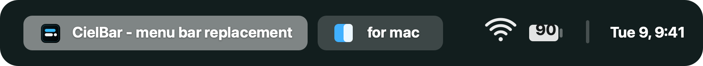

# CielBar

<p align="center" dir="auto">
  
  <p align="center" dir="auto">
    <a href="LICENSE">
      
    </a>
    <a href="CHANGELOG.md">
      
    </a>
    <a href="https://github.com/mocki-toki/barik">
      
    </a>
  </p>
</p>

**CielBar** is a lightweight macOS menu bar replacement for users who run tiling window managers such as [yabai](https://github.com/koekeishiya/yabai) or [AeroSpace](https://github.com/nikitabobko/AeroSpace). It displays spaces, windows, media, network, battery, and time information in a compact macOS-style panel.

CielBar is an independent fork of [barik](https://github.com/mocki-toki/barik). The original project and MIT copyright notice are preserved in [LICENSE](LICENSE).

<br>

<div align="center">
  <h3>Screenshots</h3>
  
  
</div>
<br>
<div align="center">
  <h3>Video</h3>
  <video src="https://github.com/user-attachments/assets/33cfd2c2-e961-4d04-8012-664db0113d4f">
</div>

https://github.com/user-attachments/assets/d3799e24-c077-4c6a-a7da-a1f2eee1a07f

<br>

## Requirements

- macOS 14.6+

## Quick Start

1. Download the latest build from this repository's Releases page, unzip it, and move `CielBar.app` to your Applications folder.
2. Optional: to display open applications and spaces, install [yabai](https://github.com/koekeishiya/yabai) or [AeroSpace](https://github.com/nikitabobko/AeroSpace) and set up hotkeys. For yabai, you also need skhd or Raycast scripts. Configure top padding as shown in [example/.yabairc](example/.yabairc).
3. Hide the system menu bar in System Settings and uncheck Desktop & Dock -> Show items -> On Desktop.
4. Launch CielBar from the Applications folder.
5. Add CielBar to your login items for automatic startup.

## Configuration

On first launch, CielBar creates:

```text
~/.cielbar-config.toml
```

It also supports the XDG-style path:

```text
~/.config/cielbar/config.toml
```

If an older barik config exists and no CielBar config has been created yet, CielBar imports it once into `~/.cielbar-config.toml`. New writes use the CielBar path.

```toml
# If you installed yabai or aerospace without using Homebrew,
# manually set the path to the binary. For example:
#
# yabai.path = "/run/current-system/sw/bin/yabai"
# aerospace.path = ...

theme = "system" # system, light, dark

[widgets]
displayed = [ # widgets on menu bar
    "default.spaces",
    "spacer",
    "default.nowplaying",
    "default.network",
    "default.battery",
    "divider",
    # { "default.time" = { time-zone = "America/Los_Angeles", format = "E d, hh:mm" } },
    "default.time",
]

[widgets.default.spaces]
space.show-key = true
window.show-title = true
window.title.max-length = 50

# A list of applications that will always be displayed by application name.
# Other applications will show the window title if there is more than one window.
window.title.always-display-app-name-for = ["Mail", "Chrome", "Arc"]

[widgets.default.nowplaying.popup]
view-variant = "horizontal"

[widgets.default.battery]
show-percentage = true
warning-level = 30
critical-level = 10

[widgets.default.time]
format = "E d, J:mm"
calendar.format = "J:mm"

calendar.show-events = true
# calendar.allow-list = ["Home", "Personal"]
# calendar.deny-list = ["Work", "Boss"]

[widgets.default.time.popup]
view-variant = "box"

### EXPERIMENTAL, WILL BE REPLACED BY STYLE API IN THE FUTURE
[experimental.background]
displayed = false
height = "menu-bar"
blur = 3

[experimental.foreground]
height = "menu-bar"
horizontal-padding = 25
spacing = 15

[experimental.foreground.widgets-background]
displayed = false
blur = 3
```

## Roadmap

CielBar will focus on project identity cleanup, release stability, configuration ergonomics, and better day-to-day window-manager integration. Longer term, widgets should be flexible enough to live beyond the top menu bar, including bottom, left, and right screen edges.

## Now Playing Support

The Now Playing widget currently supports:

1. Spotify, through the desktop application.
2. Apple Music, through the desktop application.

Create an issue if you want another music service considered.

## Where Are the Menu Items?

Menu items such as File, Edit, and View are not currently supported. This limitation was originally tracked upstream in [#5](https://github.com/mocki-toki/barik/issues/5) and [#1](https://github.com/mocki-toki/barik/issues/1).

You can use [Raycast](https://www.raycast.com/) as a workaround because it supports menu items through an interface similar to Spotlight. If you need the system menu bar, move your mouse to the top of the screen to reveal it.


## Contributing

Contributions are welcome. Please open issues and pull requests against the CielBar repository.

## License

[MIT](LICENSE)

This project is based on [barik](https://github.com/mocki-toki/barik). See [LICENSE](LICENSE) for the original MIT license notice and the CielBar copyright notice.

## Trademarks

Apple and macOS are trademarks of Apple Inc. This project is not connected to Apple Inc. and does not have their approval or support.

## Upstream

Original project: [mocki-toki/barik](https://github.com/mocki-toki/barik)
